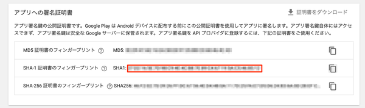

# MyFirebaseAuthSample

Firebase AuthenticationによりGoogleログインを使用して認証するサンプル（デモ）アプリです。

[Firebaseのドキュメント](https://firebase.google.com/docs/auth/android/google-signin)をもとに、GoogleアカウントでFirebaseでのユーザ認証をしています。


# 準備

## Firebaseへのプロジェクト登録

FirebaseにAndroidプロジェクトを登録し、生成される`google-services.json`ファイルをappフォルダに追加します。

## パッケージ名の修正

app/build.gradleに記述されているパッケージ名をFirebaseに登録したプロジェクトのパッケージ名に修正します。

```app/build.gradle
android {
    defaultConfig {
        applicationId "com.hnimrod.myfirebaseauthsample" // ここを修正
    }
}        
```

## FirebaseプロジェクトでGoogle認証を有効化

Firebase AuthenticationでGoogleログインでの認証を有効化します。

設定は、FirebaseプロジェクトのAuthenticationにあるSign-in methodから設定できます。


## FirebaseプロジェクトでSHA証明書フィンガープリントを追加

Googleログイン認証を使うためにはSHA1のフィンガープリントが必要になるため、Firebaseプロジェクトに登録する必要があります。

アプリのSHA1はgradleの`signingReport`タスクで確認することができます。


取得できたSHA1をFirebaseプロジェクトに登録します。
登録先はFirebaseプロジェクトのSettingsページの全般にあるSHA証明書フィンガープリントです。


## Google Play アプリ署名(Google Play App Signing)を利用する場合

Google Playアプリ署名を利用すると、上記の`signingReport`タスク確認した署名鍵とは別の鍵を用いてPlayストア側で再署名が行われます。

そのため、FirebaseプロジェクトのSHA証明書フィンガープリントには、実際にPlayストアから配布されるアプリの署名鍵SHA-1フィンガープリントを登録する必要があります。

対象のSHA-1フィンガープリントは、Google Play Consoleの「リリース管理」にある「アプリの署名」で確認することができます。




# スクリーンショット

|未ログイン状態|ログイン状態|
|---|---|
|||

# Google Play

<a href='https://play.google.com/store/apps/details?id=com.hnimrod.myfirebaseauthsample&utm_source=github&utm_campaign=github&pcampaignid=pcampaignidMKT-Other-global-all-co-prtnr-py-PartBadge-Mar2515-1'></a>
