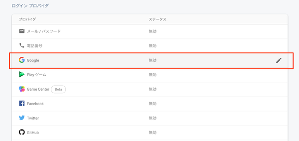
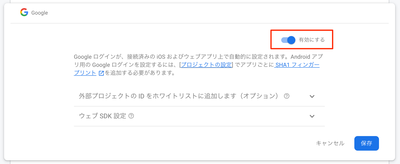
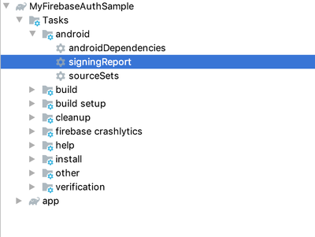
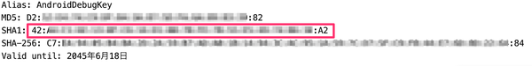
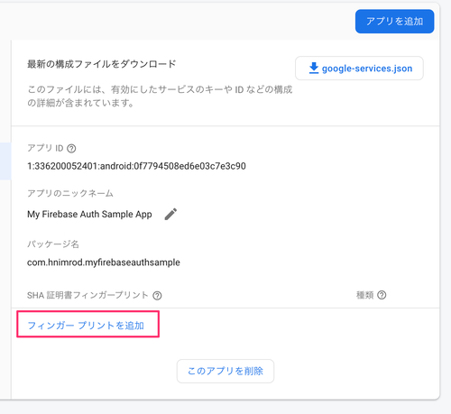
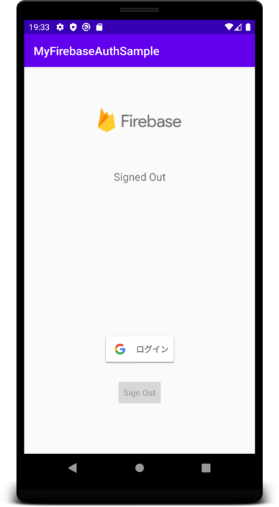

# MyFirebaseAuthSample

Firebase AuthenticationによりGoogleログインを使用して認証するサンプル（デモ）アプリです。

[Firebaseのドキュメント](https://firebase.google.com/docs/auth/android/google-signin)をもとに、GoogleアカウントでFirebaseでのユーザ認証をしています。


# 準備

## Firebaseへのプロジェクト登録

FirebaseにAndroidプロジェクトを登録し、生成される`google-services.json`ファイルをappフォルダに追加します。

## パッケージ名の修正

app/build.gradleに記述されているパッケージ名をFirebaseに登録したプロジェクトのパッケージ名に修正します。

```app/build.gradle
android {
    defaultConfig {
        applicationId "com.hnimrod.myfirebaseauthsample" // ここを修正
    }
}        
```

## FirebaseプロジェクトでGoogle認証を有効化

Firebase AuthenticationでGoogleログインでの認証を有効化します。

設定は、FirebaseプロジェクトのAuthenticationにあるSign-in methodから設定できます。





## FirebaseプロジェクトでSHA証明書フィンガープリントを追加

Googleログイン認証を使うためにはSHA1のフィンガープリントが必要になるため、Firebaseプロジェクトに登録する必要があります。

アプリのSHA1はgradleの`signingReport`タスクで確認することができます。





取得できたSHA1をFirebaseプロジェクトに登録します。
登録先はFirebaseプロジェクトのSettingsページの全般にあるSHA証明書フィンガープリントです。




# スクリーンショット

|未ログイン状態|ログイン状態|
|---|---|
|||

